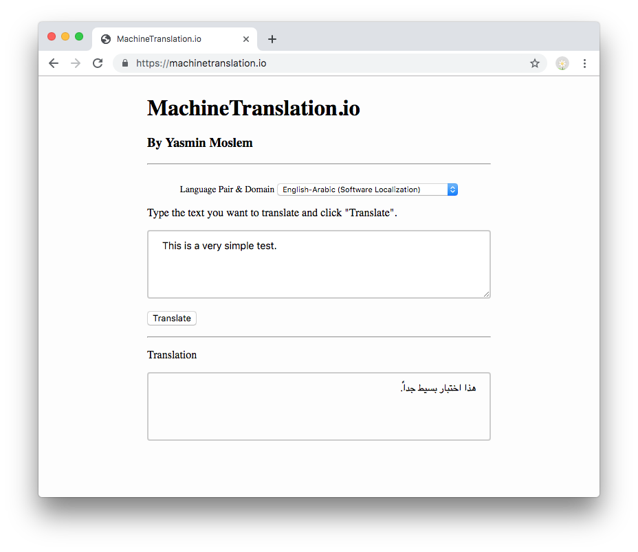

# OpenNMT-GUI
Machine Translation Web Interface for OpenNMT

## Description
This is a simple *web* interface to be able to translate sentences on the web. It depends on Python Flask and Flask-PageDown libraries. It assumes you have already implemented an [OpenNMT Rest API Server](http://forum.opennmt.net/t/simple-opennmt-py-rest-server/1392).

If you are rather looking for a stand-alone excutive GUI for Windows, check my blog post [here](https://blog.machinetranslation.io/stand-alone-executable-gui-opennmt/).

## [NEW] CTranslate2 Web Interface

Now, it is highly recommended to use [CTranslate2](https://github.com/OpenNMT/CTranslate2) as an inference engine for your models due to its high performance. You can use the new web interface version using CTranslate2 and Streamlit. Check the new [NMT web interface here](https://github.com/ymoslem/CTranslate-NMT-Web-Interface).
